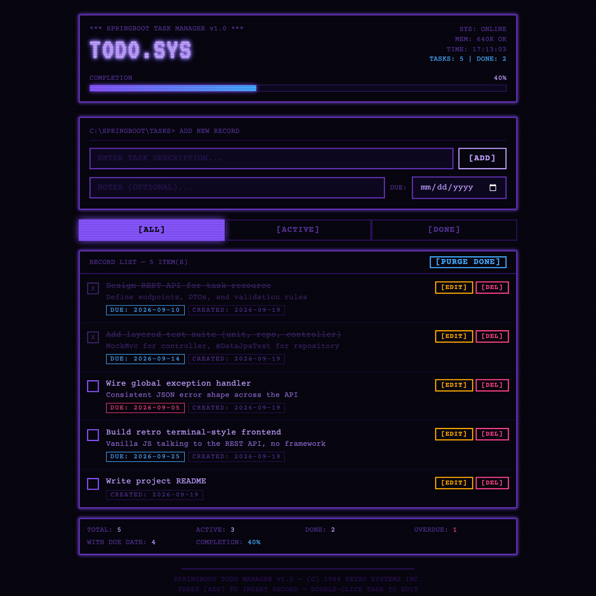

# Todo App

A task management REST API built with Spring Boot, paired with a small vanilla JS frontend. The focus of this project is the backend: a layered architecture (controller → service → repository), DTO-based request/response contracts, bean validation with structured error responses, and a test suite that covers each layer independently.



## Features

- Full CRUD on tasks, plus a dedicated endpoint to toggle completion
- Filter tasks by completion status, due date, or a case-insensitive title search
- Bean Validation (`@NotBlank`, `@Size`) with a global exception handler that returns structured, field-level error messages
- Layered test suite: controller tests (`@WebMvcTest` + MockMvc), service unit tests (Mockito), and repository tests (`@DataJpaTest`)
- A dependency-free frontend (no build step, no npm) that talks to the REST API directly

## Tech Stack

- **Java 21**
- **Spring Boot 4** — Spring MVC, Spring Data JPA, Bean Validation
- **H2** — in-memory database for local development
- **JUnit 5 + Mockito** — test suite
- **Lombok** — reduces boilerplate on entity/model classes
- **Maven** — build and dependency management
- **HTML, CSS, vanilla JavaScript** — frontend, served as static resources

## Architecture

The backend follows a standard layered structure to keep HTTP concerns, business logic, and persistence separate and independently testable:

```
src/main/java/com/example/todo/
├── controller/    REST endpoints (TaskController)
├── service/       Business logic (TaskService)
├── repository/    Spring Data JPA repository
├── entity/        JPA entity (Task)
├── dto/           Request/response DTOs — the API never exposes the entity directly
├── mapper/        Entity <-> DTO mapping
├── exception/     Custom exceptions and a @RestControllerAdvice global error handler
└── config/        Application configuration (H2 console setup)

src/main/resources/
├── application.yml   Application configuration
└── static/            Frontend (index.html, style.css, app.js)
```

**Why DTOs instead of exposing the entity?** Keeping `Task` (the JPA entity) separate from `TaskRequestDto` / `TaskResponseDto` means validation rules, API shape, and persistence mapping can evolve independently — the database schema is never accidentally dictated by, or exposed through, the JSON contract.

## API Reference

Base path: `/api/tasks`

| Method | Path | Description |
|--------|------|-------------|
| POST   | `/api/tasks` | Create a new task |
| GET    | `/api/tasks` | List tasks (supports `completed`, `dueBefore`, `search` query params) |
| GET    | `/api/tasks/{id}` | Get a single task by id |
| PUT    | `/api/tasks/{id}` | Replace a task's fields |
| PATCH  | `/api/tasks/{id}/complete` | Toggle a task's completed status |
| DELETE | `/api/tasks/{id}` | Delete a task |

A task has: `title` (required, max 100 chars), `description` (optional, max 500 chars), `completed` (boolean), and `dueDate` (optional).

<details>
<summary>Example: creating a task</summary>

```bash
curl -X POST http://localhost:8080/api/tasks \
  -H "Content-Type: application/json" \
  -d '{"title": "Write project README", "dueDate": "2026-09-25"}'
```

```json
{
  "id": 1,
  "title": "Write project README",
  "description": null,
  "completed": false,
  "dueDate": "2026-09-25",
  "createdAt": "2026-09-19T17:13:02.51",
  "updatedAt": "2026-09-19T17:13:02.51"
}
```
</details>

<details>
<summary>Example: validation error response</summary>

Sending a task with a blank title returns a `400` with a field-level error map instead of a generic stack trace:

```json
{
  "timestamp": "2026-09-19T17:13:02.51",
  "status": 400,
  "error": "Bad Request",
  "message": "Validation failed",
  "path": "/api/tasks",
  "fieldErrors": {
    "title": "Title is required"
  }
}
```
</details>

## Testing

The test suite mirrors the layered architecture, so each layer is tested at the right level rather than everything going through slow, full-context integration tests:

- **`TaskControllerTest`** — `@WebMvcTest`, only the web layer, dependencies mocked, verifies HTTP status codes, JSON shape, and validation error responses
- **`TaskServiceTest`** — plain Mockito unit tests against the business logic, no Spring context
- **`TaskRepositoryTest`** — `@DataJpaTest`, verifies the custom query derivation methods against a real (in-memory) database

```bash
./mvnw test
```

## Getting Started

### Prerequisites

- Java 21 or later
- The Maven Wrapper is included, so a separate Maven install is not required

### Run it

```bash
./mvnw spring-boot:run
```

On Windows:

```bash
mvnw.cmd spring-boot:run
```

The app starts on **http://localhost:8080**. Open that URL in a browser to use the frontend, or call the API directly (`curl`, Postman, etc.).

### Database

This project uses an in-memory H2 database, so no external setup is required — data resets each time the app restarts.

To inspect the database directly, the H2 web console runs on its own port:

1. Start the app.
2. Open **http://localhost:8082** in a browser.
3. Log in with:
   - **JDBC URL:** `jdbc:h2:mem:tododb`
   - **User Name:** `sa`
   - **Password:** (leave blank)

## Possible Improvements

Honest notes on trade-offs made for this project's scope, and what I'd change for a production system:

- `GET /api/tasks` currently loads all rows and filters in memory with Java streams. `TaskRepository` already declares the query-derivation methods (`findByCompleted`, `findByDueDateBefore`, `findByTitleContainingIgnoreCase`) needed to push that filtering down to the database — swapping to those (or a `Specification`) would be the first change needed to scale past an in-memory dataset.
- Swap H2 for Postgres/MySQL with Flyway/Liquibase migrations for a real deployment.
- Add pagination to `GET /api/tasks` once task lists grow large.
- No auth layer yet — tasks are global rather than scoped to a user account.
